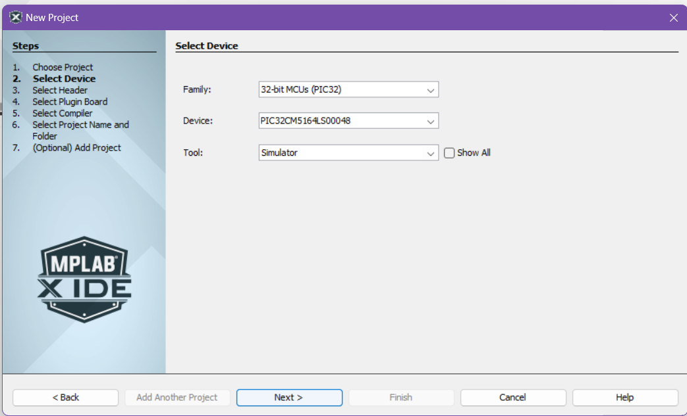
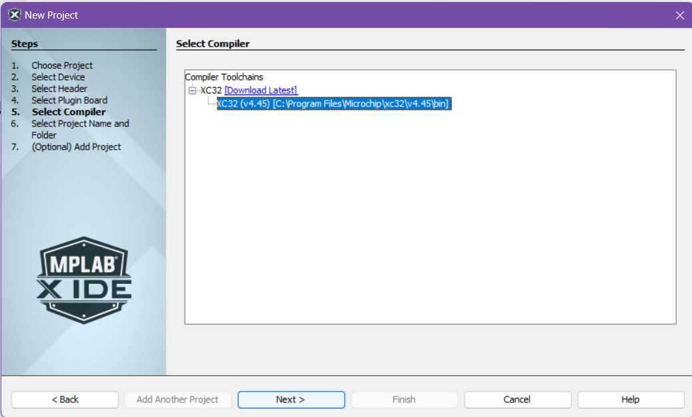

# MPLAB First Steps

## Installation

### Install MPLAB X IDE

Install MPLAB X IDE through the official Microchip site: [MPLAB X IDE](https://www.microchip.com/en-us/tools-resources/develop/mplab-x-ide)

### Install XC32 Compiler

Install the XC32 COmpilers from Microchip: [MPLAB xC32 Compilers](https://www.microchip.com/en-us/tools-resources/develop/mplab-xc-compilers/xc32#downloads)

## Your First MPLAB Project

- Create a New Project


- Choose `Application Project(s)` then click `Next >`


- Choose the following for `2. Select Device`
  - `Device`: `PIC32CM5164LS00048`
  - `Tool`: `Simulator`

  *note: you can always change the tool later, will be useful once we move from using the simulator to actual hardware*



- Choose a installed XC32 Compiler
  - *note: if you do not see options for compilers, make you have properly installed the XC32 Compilers from the `Install XC32 Compilers` Step*



- Select where to save your Project on your local machine then click `Finish`

*note: We suggest creating a new folder within another folder when you create a project as another folder will be generated in the same directory as the path you choose here (i.e. if you plan on storing all your Projects in a folder called `MyProjects`, create a folder `MyProjects/MyFirstProject` and choose `MyFirstProject` as the place to save)*


- Your First Project should now initialize


- We now proceed to setting up the MPLAB Code Configurator, It will either open up automatically or you can open it by clicking on the `MCC` icon on the top ribbon


### MPLAB Code Configurator

- Download content for MPLAB Code Configurator (MCC)


- On your first time opening, MCC will automatically ask you to download some files.

#### Board Packages

- Chip Support Package: proceed to also include `csp_apps_pic32cm_le_ls` from under `Harmony 3 - Chip Support Packages`


- Core Apps Package: proceed to also include `core_apps_pic32cm_le_ls` from under `Harmony 3 - Core`


*note: you can also add these packages later by opening up the `Content Manager` (CM button beside MCC) if you don't install them now*

#### MCC Harmony Windows

We now proceed with using MCC to easily create some configurations for our Microcontroller

Open up `MCC` and navigate to `Pin Configuration` either through the ribbon or through the Project Graph


We can use a GUI to set up the pins of our Microcontroller. Proceed to set up PA15 as Output Pin as shown. Take note of the `Security Mode` being set as `NON-SECURE` as well.


- Click on Generate to generate your configuration code


You should now see in your Project folder more files, these were auto generated by MCC. The interesting one here is the header file `plib_port.h`


You can use these newly declared definition in you code to control the Pin.

- Go to `main.c` under `Source Files`


Here is where you can start creating your application. Let's try and blink an LED by switching a pin between HIGH and LOW.

## Guided Exercise: "Blinky!"

### Blinky!

- in `main.c` add the function call `LED_PIN_Toggle();` and also this `crude_delay_ms()` function before `main()`

```C
int crude_ms_delay(int ms){
    int count = 0;
    unsigned int delay_count = ms * 12000;
    
    while(count < delay_count){
        asm("nop");
        count = count + 1;
    }
    return 0;
}


int main ( void )
{
    /* Initialize all modules */
    SYS_Initialize ( NULL );

    while ( true )
    {
        LED_PIN_Toggle();
        crude_ms_delay(1000);
        /* Maintain state machines of all polled MPLAB Harmony modules. */
        SYS_Tasks ( );
    }

    /* Execution should not come here during normal operation */

    return ( EXIT_FAILURE );
}
```

Let us first try Building our Application. Press the `Build` Icon to compile your project. It's the one that looks like a hammer


If it builds, we are now ready to try and debug your application using the Simulator. 

### Simulator Debugging

## Guided Exercise: "Hello World"

### "Hello World"

### Logic Analyzer