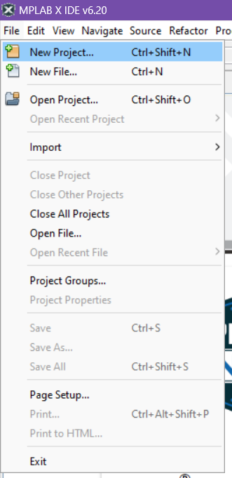
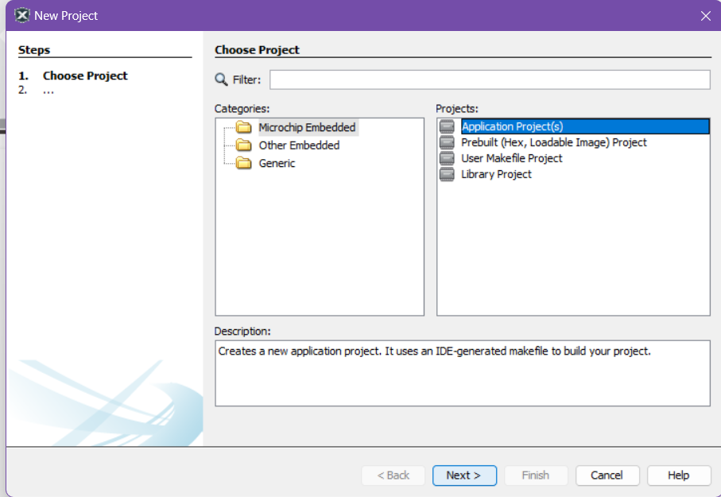
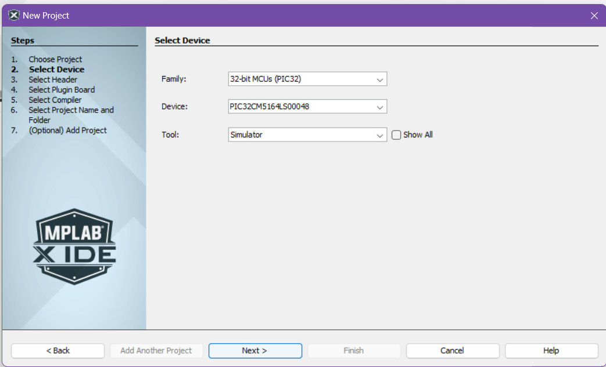
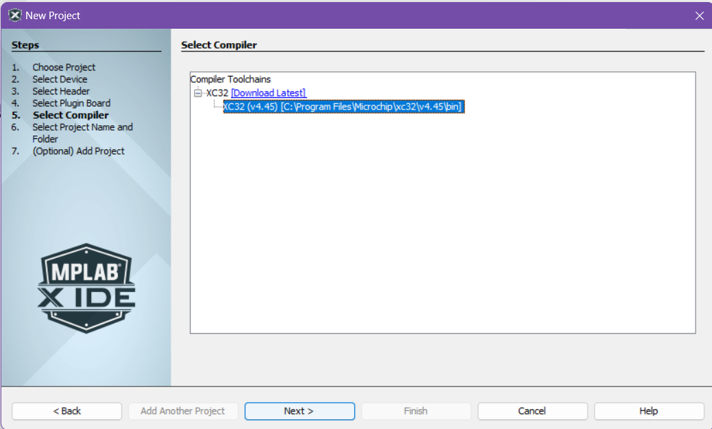
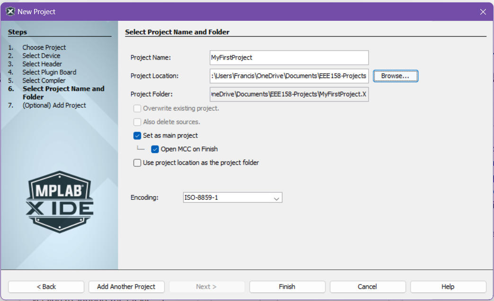
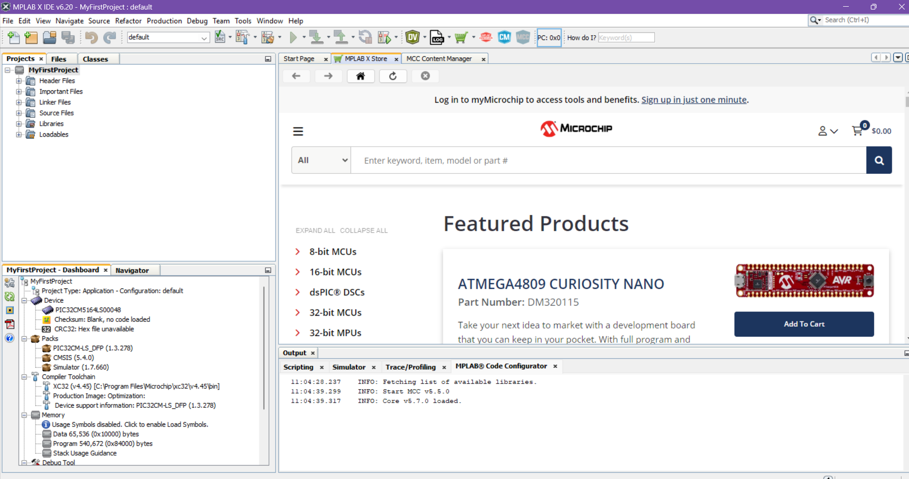

# MPLAB Installation and First Project Guide

## Install MPLAB X IDE

[MPLAB X IDE](https://www.microchip.com/en-us/tools-resources/develop/mplab-x-ide)

## Install xC32 Compiler

[MPLAB xC32 Compilers](https://www.microchip.com/en-us/tools-resources/develop/mplab-xc-compilers/xc32#downloads)

## Your First MPLAB Project

- Create a New Project

- Choose `Application Project(s)` then click `Next >`

- Choose the following for 2. Select Device
  - `Device`: `PIC32CM5164LS00048`
  - `Tool`: `Simulator`

- Choose a installed XC32 Compiler
  - *note: if you do not see options for compilers, make you have properly installed the XC32 Compilers from the `Install XC32 Compilers` Step*

- Select where to save your Project on your local machine then click `Finish`

- Your First Project should now initialize

- Downloading content for MPLAB Code Configurator (MCC)

## Board Packages

## Exercises

### Blinky

### "Hello World"

### Logic Analyzer